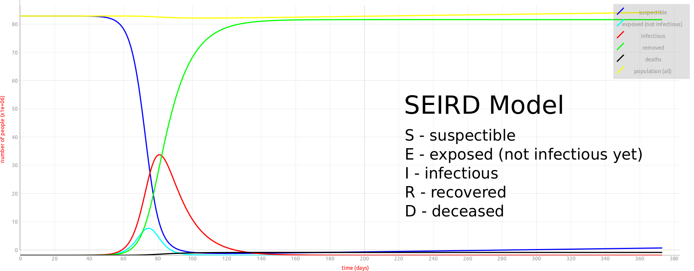

# Simulating SIR Models  

This is a simple Python app based on Qt5 to simulate the spreading of an infectious disease using **[SIR type models](https://de.wikipedia.org/wiki/SIR-Modell)**. This includes the 

	* the simple SIR model
	* the SIRD model
	* the SEIR model
	* the SEIRD model
	
You will need
	
	* Python 3
	* PyQt5
	* PyQtGraph
	
The models can be fed with real data. Have fun experimenting. 